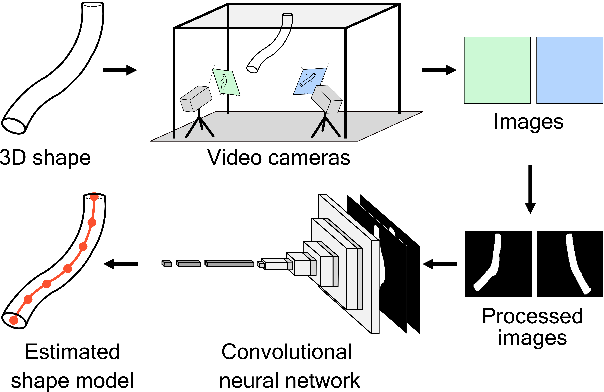

# ViSE
Code accompanying the paper ViSE: Vision-Based Real-Time 3D Shape Estimation of Continuously Deformable Robots.

## Performance
Estimation errors **with respect to the corresponding robot's length** 

|                                   | Estimation Technique.        | Number of Cameras | Robot Type  | Robot Length (mm) | Tip Error     |
| --------------------------------: | :--------------------------: | :---------------: | :---------: | :---------------: | :-----------: |
| **ViSE (ours)**                   | CNN                          | 2                 | WaxCast arm | 335               | **0.4%±0.3%** |
| **ViSE (ours)**                   | CNN                          | 2                 | SoPrA       | 270               | **1.1%±0.6%** |
| **ViSE (ours)**                   | CNN                          | 2                 | Soft fish   | 115               | **2.8%±2.3%** |
| Camarillo et al.                  | 2D point-cloud fit           | 3                 | Soft arm    | 160               | 4.8%          |
| Vandini et al.                    | Line feature detector        | 1                 | Soft arm    | 260               | 2.8%          |
| Pedari et al.                     | LED light placement          | 2                 | Soft arm    | 468               | 4.5%          |
| AlBeladi et al.                   | Edge detection & curve fit   | 1                 | Soft arm    | 287               | 4.5%±3.1%     |

> * not provided, calculated based on their estimation data

## Requirements and Installation
The repo was written using *Python 3.8* with [`conda`](https://github.com/JacopoPan/a-minimalist-guide#install-conda) on *Ubuntu 20.04*
